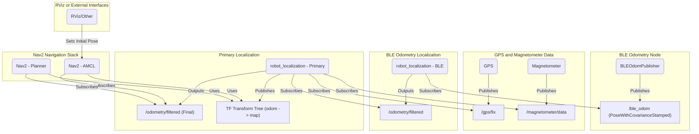

# ble_odom

Basic position estimation based on RSSI of Eddystone BLE beacons.

Integrate into [robot_localization](https://docs.ros.org/en/melodic/api/robot_localization/html/index.html)

Can also subscribe to a magnetometer and send an estimated initial pose to the [Nav2](https://docs.nav2.org/) stack for navigation to avoid the manual process of sending it. 

This might be able to be used with other BLE beacons, but tested with Eddystone ones like these: [DX-CP28](https://www.aliexpress.us/w/wholesale-DX%2525252dCP28.html)

Accuracy in an open, controlled room is hopefully around 1-1.5 meters. Othe environments, perhaps 3 meters with 4 beacons. Since it uses RSSI instead of something more accurate like Bluetooth Angle of Arrival (AoA) and Angle of Departure (AoD)

To learn more about Bluetooth Angle of Arrival (AoA) and Angle of Departure (AoD), you can refer to the [Silicon Labs whitepaper](https://www.silabs.com/whitepapers/bluetooth-angle-estimation-for-real-time-locationing)


```sh
ros2 launch deepdrive_bringup robot.launch.py

colcon build --symlink-install --packages-select=ble_odom
source install/setup.sh
ros2 launch ble_odom ble_odom.launch.py

```




