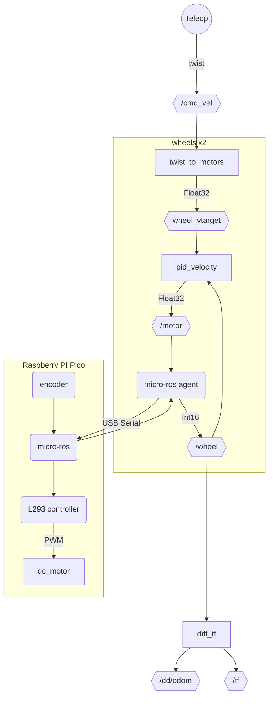
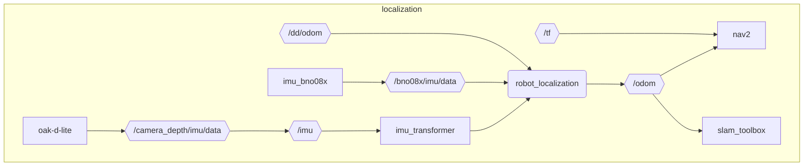

# Deepdrive Hardware

Talks to Raspberry PI pico via micro ros to control motors and read some sensors.

This is an initial implementation. We'll get some latency going through the topics. Once it's working, we can optimize, do more logic on the microcontroller and do it all in C++ based on the [turtlebot3 repo](https://github.com/ROBOTIS-GIT/turtlebot3/blob/humble-devel/turtlebot3_node). For now, we can probably lower the control loop rates to prevent the topics from being overflowed.

1 PID controller per wheel

---

Pulled from:
https://github.com/eden-desta/ros2_differential_drive/blob/ros2/src/differential_drive

See [differential_drive.md](./differential_drive.md) or https://wiki.ros.org/differential_drive for configuration info.

