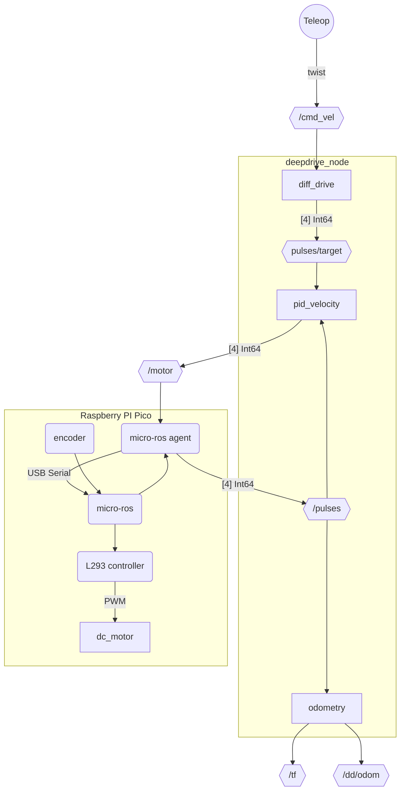
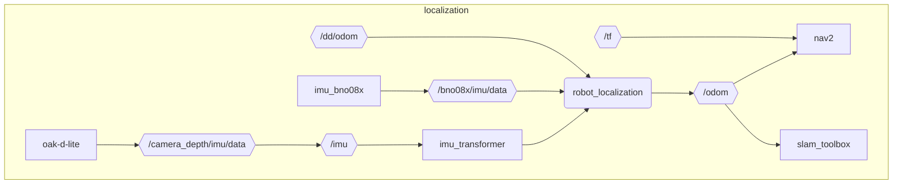

# Differential drive

## Installation
```sh
colcon build --symlink-install --packages-select deepdrive_node
source install/setup.sh
```

Make sure to activate your workspace afterwards.

## Usage

```sh
ros2 run deepdrive_node deepdrive_node
ros2 launch deepdrive_node deepdrive_node.launch.py
```

## Tests
```sh
colcon build --symlink-install --packages-select deepdrive_node
colcon test --packages-select deepdrive_node
colcon test-result --verbose
```

TODO:
- [ ] timer for odom output
- [ ] acceleration/jerk
- [ ] Update PID params on the fly
- [ ] Round 0 values
- [ ] Put PID controller on microcontroller. This would make one signal easier to share between wheel. PID would make them match. https://github.com/pms67/PID/tree/master


Talks to Raspberry PI pico via micro ros to control motors and read some sensors.

1 PID controller per wheel
Raspberry Pi sends TOTAL pulse counts to `/pulses`. PID controller uses the diff since the last message to check the velocity.




---


