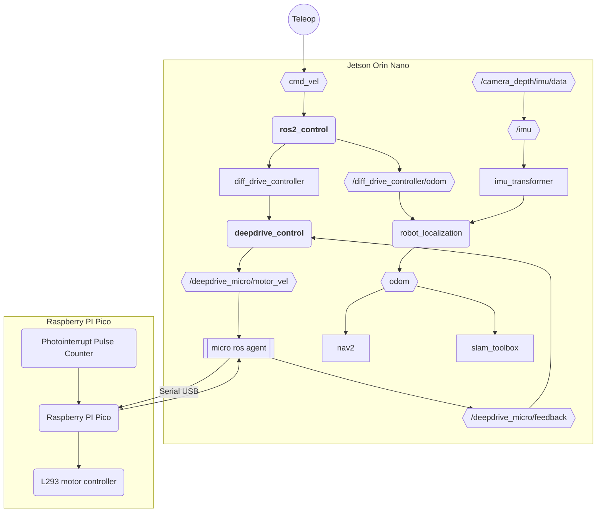

# deepdrive_node

Talks to Raspberry PI pico to control motors and read some sensors.

# TODO: remove ros2_control from diagram

Uses `deepdrive_control/DeepdriveSystemHardware` as the hardware interface. 

This would probably be more efficient not using the micro ros framework or without ros2 control. We'll get some latency going through the topics. Once it's working, we can optimize later. For now, we can probably lower the control loop rates to prevent the topics from being overflowed.

Topic `/deepdrive_micro/motor_vel` will take the number of ticks/s desired by the motor controller and which direction and which motor. 

TODO: figure out which message and names to use for `/deepdrive_micro/motor_vel` and `/deepdrive_micro/feedback` 

`deepdrive_control/DeepdriveSystemHardware` subscribes to `/deepdrive_micro/feedback` to get the number of ticks total and number of ticks/s. 